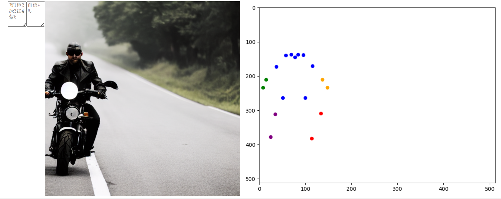

# User Study Details for Pose Quality
## Protocal
### We conduct the user study by designing and sending out questionnairy. We invite 26 people to participate in the user study. We randomly select 5 images describing different HOI samentics, and adopt pose detector to acquire its keypoints coordinates as well as their confidence scores. Then we split all keypoints into 5 groups according to keypoint meaning: Left arm, Right arm, Left leg, Right leg and Turso. Each user are required to select the worst generation part among these human 5 parts. Further, we collected confidence ratings for each user regarding their self-evaluations as part of the user study. These ratings were used to gauge the level of certainty and trustworthiness individuals attributed to their own assessments, and we further conduct a statistical test based on these confidence ratings to evaluate the validity of the user study. It takes about 5 minutes for each user to finish the questionairy. Here we provide one example for the user study questionary.
<!---->

    
    
 An example for our questionairy interface

## Results and Discussion

### We report the selection of worst part of generated human as well as the score of pose detector for the sample shown in above Figure. The result is shown in the following table.

| Parts | Left_Arm | Right_Arm | Left_Leg | Right_Leg | Turso |
| ------------ | ------------ | ------------ | ------------ | ------------ | ------------ |
| Human Selection Ratio(%) | 0 | 0 | 96.2 | 0 | 3.8
| Detection score | 79.3 | 84.2 | 37.3 | 81.5 | 66.9

### For this sample, We static the average portion on human selection of worst part of geenrated human, and the detection score is average of keypoints score for this human part. We find that human visual preference is well aligned with detector score, i.e., for the regions which has the highest portion identified by users as having the worst quality, the detector assigned the lowest scores. For other image samples in user study, we observe the same trend, indicating that pose detector score judgement aligns well with human visual preference. As for the statistical test, the average confidence and deviation for user study is 4.87 and 0.03, indicating our user study is valid and trustworthy.
