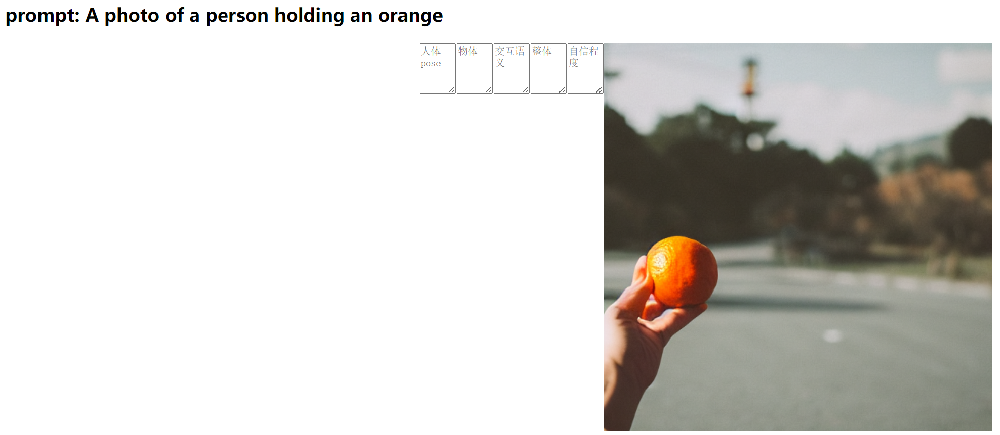

# User Study Details for Model Performance Comparison
## Protocal
### We conduct the user study by designing and sending out questionnairy. We invite 26 people to participate in the user study. We randomly select 10 prompts describing different HOI categories, and generate images using these prompts with 4 Different models(Stable Diffusion, SAG, Diff-HPC and our PIA-HOI), then we present them randomly for blindness. Each ask the participants to rate the quality of images from multiple aspects(introduced in following Metrics). To make the scores more authoritative and trustworthy, we also provide additional realistic images from our benchmark for each prompt to rate. It takes about 30 minutes for each user to finish the questionairy. In total, we get 1300 responces to static on the performance comparison among different models. Here we provide one example for the user study questionary.
<!---->

    
    
 An example for our questionairy interface

## Metrics
### For each image, users are required to rate ir from multiple aspects. The aspects are listed as follows:

### 1. Human Pose Realisity: the rationale of length, number and angles of human limbs.
### 2. Object Appearance: the appearance of the objects in the generated image.
### 3. Interaction Semantics: the fidelity of the interaction of human and object in generated image to the described prompt.
### 4. Overall Quality: the overall quality of the generated image.
 
### The above rating are all from 1 to 5, with 1 being the lowest(worst, not even acceptable) and 5 being the highest(best, perfect). The correspoinding scores for realistic images are utilized as a reference for (1)the quality span from generation images to real ones  (2) the human evaluation quality. Further, we collected confidence ratings for each user regarding their self-evaluations as part of the user study. These ratings were used to gauge the level of certainty and trustworthiness individuals attributed to their own assessments, and we further conduct a statistical test based on these confidence ratings to evaluate the validity of the user study.

## Results and Discussion

### The average score for each aspect is shown in the following table.

| Aspect | Stable Diffusion | SAG | Diff-HPC | PIA-HOI | Realistic Image |
| ------------ | ------------ | ------------ | ------------ | ------------ |------------ |
| Human Pose Realisity | 2.48 | 3.08 | 3.01 | 3.31 | 4.35|
| Object Appearance | 3.24 | 3.37 | 2.27 | 3.66 |4.34 |
| Interaction Semantics | 3.67 | 3.35 | 2.97 | 4.03 | 4.09|
| Overall Quality | 2.98 | 3.04 | 2.15 | 3.54 | 4.25|

### As shown in Table, for all four above perspective, our PIA-HOI has the highest scores among all models, which manifests that our generation quality are not only owns better human pose as well as object appearance, but also better fidelity to HOI semantics, thus resulting in visually preference. As for the statistical test, the average confidence and deviation for user study is 4.32 and 0.17, indicating our user study is valid and trustworthy.